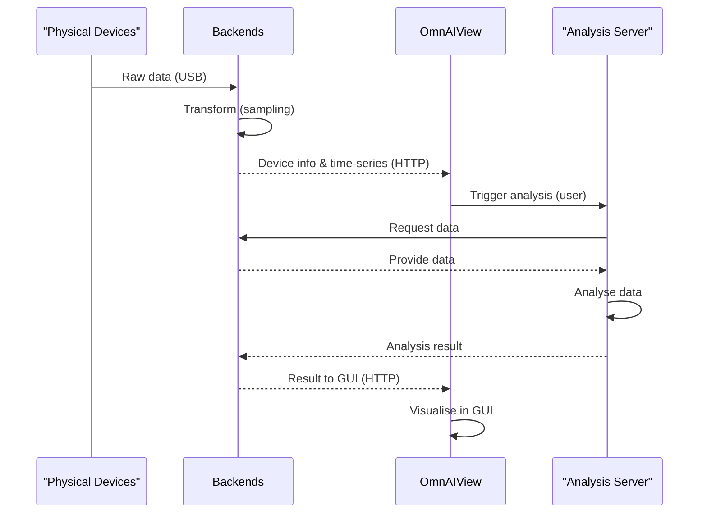

## 1. When to read this

Reading Group: 
- I want to contribute but i am not sure where to add my code 

The goal of this file is to give an overview of the components of the software as well as their connection to each other. 
Read this if you have questions regarding the setup and where what should be implemented how. 

## 1. General architecture 

This describes the architecture shortly on a high level basis. 

### Context 

For context of the application read the [VISION.md](/VISION.md)

### Enviroment/ Code setup/ Container Base

The codebase contains an angular project and an electron project. 

The angular project is a rendered window in the browser.
The electron project includes this rendered window in a application that starts locally. 

Local access is done by the electron app. For example: access to the filesystem, starting other applications. 
Everything else in the GUI is done by the angular app. 

**We don't have a backend in this repository** 

In the application multiple backends can be connected. You will understand later how. 
Important is that the electron app itself is not the backend, it only communicates with backends written in other repositorys. 

**The end application will run on the user laptop as an executable NOT in the browser** 

### Components 

This includes all components used in the end-application, this does not only include the end-application components itself. 

**Components**:

- physical devices 
- backends 
- OmnAIView application
- analysis server 

**physical devices**: Physical devices like a multimeter or the [OmnAIScope](https://omnaiscope.auto-intern.de/). Purpose: Measure physical data

**backends**: Backends written in different languages . Purpose: Receive, transform, provide data. (Either from physical devices or generated)

**OmnAIView**: Electron frontend application rendering an angular window. Purpose: Receive, visualize, provide interaction with data. 

**analysis server**: Analysis written in different languages running on some servers. Purpose: Receive, analyse data, provide result. 

### Connection between components 

The connection between components is visualized in the graphic below. 

The physical devices measure data. 
The backends receive this data (example: via USB-protocol) . 
The backends transform this data (example: sampling). 
The backends provide information about connected devices via http protocol (example: UUID ). 
The backends provide time-series data via http protocol (example: data[timestamp: x; value: y]). 
OmnAIView receives the data via http protocol. 
OmnAIView visualize the data in a GUI. 
OmnAIView provides user interaction via the GUI to receive, visualize and analyze the data. 
The analysis server receive the data from the backends ( trigger for that is a user interaction in OmnAIView). 
The analysis server analyze the data. 
The analysis server provides the result of the analysis for the Backend ( the result is shown in OmnAIView). 

