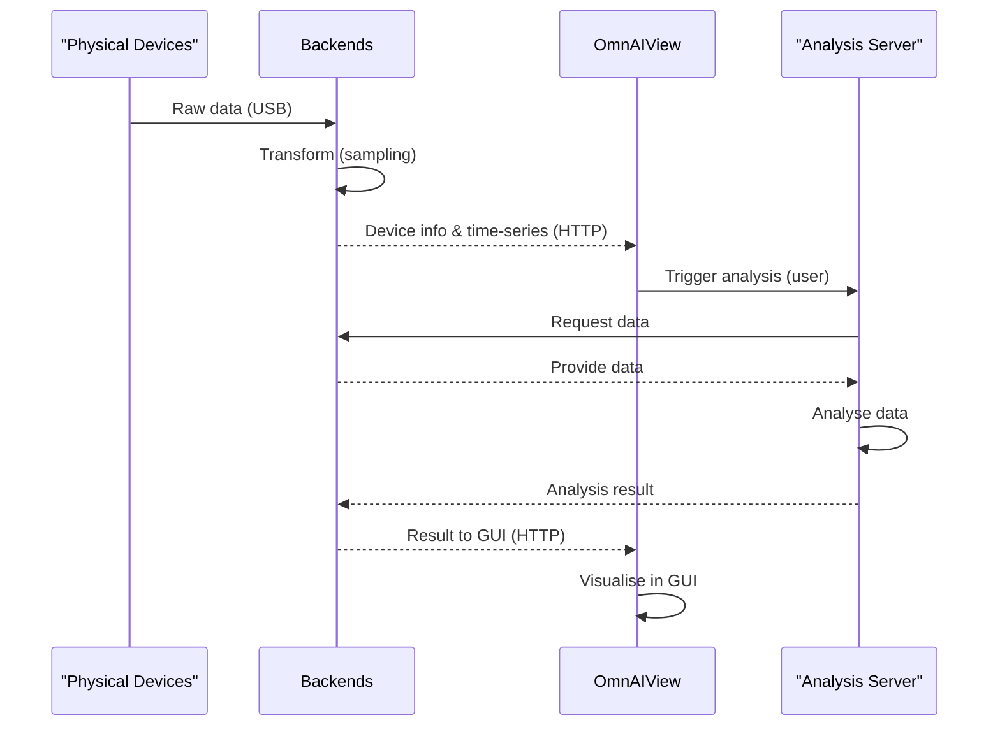

## 1. When to read this

Reading Group: 
- I want to contribute but I am not sure where to add my code 

The goal of this file is to give an overview of the components of the software as well as their connection to each other. 
Read this if you have questions regarding the setup and where to implement what logic with which guidelines. 

## 1. General architecture 

This describes the architecture shortly on a high level basis. 

### Context 

For context, refer to [VISION.md](/VISION.md) for a detailed explanation on the idea of the software.

### Enviroment/ Code setup/ Container Base

The codebase contains two  parts: an Angular frontend project and an Electron project. 

Within the Angular project, the UI is designed. Using the angular build system, a single page application (SPA) is build. The resulting set of static files (html,css,ts) and can be served by any webserver so that users can render the page in a browser of their choice. 
From the Electron project, we can build a desktop application. Electron allows to render multiple windows, each window behaving like a browser window. The build artefact from the angular project is loaded in one of these windows. As a result, we can install the UI as a desktop app as well as handle background processes that are needed for any data communication.
to display the web view in the locally running application. 
Furthermore electron provides local system-access (e.g. access to the filesystem) which Angular doesn't. 

Therefore all system-access will be handled by Electron, all GUI interactions will be handled by Angular. 

**We don't have a backend in this repository** 

We intend to connect multiple backends as datasources. The concept of how these connections are handled is explained later. 
Important is that the electron app itself is not the backend, it only communicates with backends written in other repositorys. 

**The end application will run on the user laptop as an executable NOT in the browser** 

### Components 

This chapter presents all system elements used in the end-application further refered to as "components". 

**Note**: This does not refer to Angular components or UI-specific modules. Instead, the term “components” here refers to infrastructural and functional parts of the system

**Components**:

- physical devices 
- backends 
- OmnAIView application
- analysis server 

**physical devices**: Physical devices like a multimeter or the [OmnAIScope](https://omnaiscope.auto-intern.de/). Purpose: Measure physical data
These devices connect to a host system (e.g. PC, RSP) that runs an artifact (backend) which receives the data via a connection (e.g. USB, WiFi, CAN).

**backends**: Backends written in different languages . Purpose: Receive, transform, provide data. (Either from physical devices or generated)

**OmnAIView**: Electron frontend application rendering an angular window. Purpose: Receive, visualize, provide interaction with data. 

**analysis server**: Analysis written in different languages running on some servers. Purpose: Receive, analyse data, provide result. 

### Connection between components 

The connection between components is visualized in the graphic below. 

The physical devices measure data. 
The backends receive this data (example: via USB-protocol) . 
The backends transform this data (example: sampling). 
The backends provide information about connected devices via http protocol (example: UUID ). 
The backends provide time-series data via http protocol (example: data[timestamp: x; value: y]). 
OmnAIView receives the data via http protocol. 
OmnAIView visualize the data in a GUI. 
OmnAIView provides user interaction via the GUI to receive, visualize and analyze the data. 
The analysis server receive the data from the backends ( trigger for that is a user interaction in OmnAIView). 
The analysis server analyze the data. 
The analysis server provides the result of the analysis for the Backend ( the result is shown in OmnAIView). 

