# Draft

In the following sections we'd like to share our first draft of the OmnAIView. We start with our initial desktop app and define our requirements for the new app right after that.

# Starting point for a new app

We already have a functioning `.exe` for our scopes which shows the following GUI:

However we want to **start from scratch** to get:
1. a more appealing **UI/UX** and
2. better **maintainablity**.

To archieve all this, we want to build our desktop app with [**Electron**](https://www.electronjs.org/docs/latest/) as this can combine our proprietary backend with an intelligible UI based on `html` and `css`, which will be written with [**Angular**](https://next.angular.dev/).

---

The following flowchart depicts the main aspects of what the new application should do.

Our **ideas and requirements** for the frontend and backend are presented in the following sections.

# Frontend

The frontend should be as **simple and intuitive** as possible. The emphasis is on a **BIG graph** with a **toolbar** to start/stop a measurement (grey button as placeholder for scheduled measurement), save measurement data or reset data/cancel measurement and further **settings menu** like selecting sources to be measured or files to be displayed. In a first draft it could look like this:

```mermaid
block-beta

space A("▶") B("💾") C("🗑️") D("⏺") space:10 E("⚙️")
style D opacity:0.5, fill:#ddd, stroke: #ddd
```

The **settings menu** would consist of a section for source selection from **live data** or **file data** and **analysis** part which needs to be defined. It could look like this:

Further menus would be **popup menus** for saving data, opening data and maybe for scheduling a measurement. Another thing to implement could be **tooltips** on the graph.

## First frontend

The function of the first frontend should include:

1. **Select sources** for measurement or from file
2. **Show selected data** in graph
    - Legend
    - automatic scaling of x- and y-axis
    - set intervall of x- and y-axis
    - multiple y-scales for different units
    - colors or line style to be unambigous
3. **Start/stop** measurement
4. **Change to analysis mode** (change to frequency domain for FFT) or **add new time series** with running mean or multiplication of data for analysis
5. **Save data** after measurement or save analysis data
6. **Easy reset** of settings and deleting of not saved data

# Backend

The backend should be used to:

1. **integrate** proprietary backends,
2. **search for and connect to data sources** via websockets, or listen to websockets from test sources as the [OmnAIView-DevDataServer](https://github.com/AI-Gruppe/OmnAIView-DevDataServer),
3. **listen to datastreams** from sources,
4. **handle data saving and importing from file**,
5. **send data slices to frontend** from live measurement data or file data via IPC,
6. **listen to frontend** for measurement (source selection for measurement + add additional time series like running average, multiplication for analysis, start, stop, saving data, cleanup data) or analysis of data (FFT).

## Get data streams from sources to backend

Data streams of sources are in integrated via websockets:
1. Set local webserver for source at `url-source = localhost:source-port`
2. Save information about all devices per source at `url-source/devices`
3. Connect to websocket to get data stream at `url-source/ws`

### Get data from backend to frontend (for now via websockets)

One way could be to implement another websocket to send data slices for selected sources from backend to frontend via `url-source/data_slices_ws`. Another way could be data transfer via IPC.

### Testing with simulated data streams

You're not in the lucky position to own an [**OmnAIScope**](https://omnaiscope.auto-intern.de/) to test your code under real world conditions? We feel really sorry for you and hope you will get yours very soon!

In the mean time, please fork the repo [OmnAIView-DevDataServer](https://github.com/AI-Gruppe/OmnAIView-DevDataServer) to **run test servers**.

Those servers will simulate the data streams which will be emittted by an [**OmnAIScope**](https://omnaiscope.auto-intern.de/).

# Before you start

 To write the code as lean as possible, please familiarize yourself with the technology of your choice to at least the **Beginner** level.

| Level | Angular | Electron |
| :---: | :---: |:---:|
| **N00B** | [Angular Tutorial](https://next.angular.dev/tutorials/first-app) | [Electron Tutorial](https://www.electronjs.org/docs/latest/tutorial/tutorial-prerequisites) |
| **Beginner** | [Angular Styleguide](https://next.angular.dev/style-guide) | [Electron Process Model](https://www.electronjs.org/docs/latest/tutorial/process-model)|

More on how to contribute to this project in [CONTRIBUTE.md](Contribute.md).